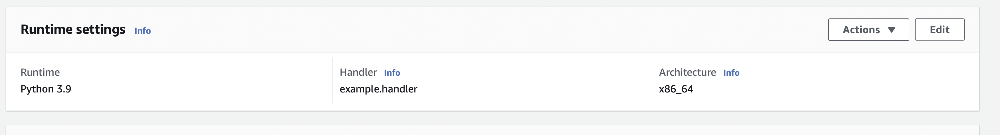

## Intro

From AWS website:

> AWS Lambda is a serverless, event-driven compute service that lets you run code for virtually any type of application or backend service without provisioning or managing servers.

Even though it's not required to use a web framework like FastAPI or Django to start using AWS Lambda,
often it is the case you have an existing project or you want to use a framework for useful features.

The [`Mangum`](https://mangum.io/) project fixes the gap between the existing ASGI Python frameworks 
to work with AWS Lambda serverless functions.
For the web framework I will be using `FastAPI` but the same can be achieved with `Starlette` applications.

AWS provides a few options for the deployment of Lambda functions, the simplest one which I will use
is to create a runtime environment and package a Zip from it and send it to AWS.
By runtime it means you will upload an archive which has all the dependencies and the logic you want for your Lambda.
In real projects of course this is not ideal and you will probably use container images.

### Simple example

First we create a virtual environment and install the required packages:

```bash
$ python3.9 -m venv venv
$ source venv/bin/activate
$ pip install fastapi mangum
```

And we will create a Zip archive from it:

```bash
$ cd venv/lib/python3.9/site-packages
$ zip -r ../../../../package.zip .
```

This will zip the virtual environment to be uploaded to AWS.

Next we create a minimal API in the file `example.py`:

```python
from fastapi import FastAPI
from mangum import Mangum

app = FastAPI()


@app.get("/")
def root():
    return {"message": "Up and running!"}


handler = Mangum(app)
```

As you can see only the last line is extra and that is how AWS will trigger our Lambda function.

Next we `cd` back into our root of project and add `example.py` to the archive too:

```bash
$ cd ../../../../
$ zip -g package.zip example.py
```

Now our archive can be uploaded to AWS. We can either do this with AWS CLI or console.

After our zip is uploaded we need to update the `Runtime settings` of the function,
so that AWS can locate the handler.
In the case of this example the handler should be set to `example.handler` meaning 
the in the `example.py` file it should look for a variable called `handler`.



Done!

Your function is deployed. Now you can go to the `configuration` tab 
of the function and create a `Function URL` which is a public/private URL you can use to test your API.

### Larger applications

Even though this is already great, there's a downside:

In real-world projects it would not be efficient to deploy the whole application in one Function.
As the Lambda Function scales up and down automatically, you might want to scale one endpoint but not the other endpoints.
If your app is deployed in one monolithic lambda it will scale up/down all together:


Instead, it is more efficient to deploy each group of endpoints in one Lambda so you can get the most from serverless architecture
and let the API Gateway manage the routing for you:


So how can we achieve this?

`FastAPI` offers `APIRouter`, or if you are familiar with `Starlette` you have `Router` instances.
Basically `APIRouter` or `Router` is a lightweight ASGI application without the middlewares,
but since they are like ASGI apps you can use them with `Mangum`.

Now create another file `complex.py`:

```python
from fastapi import FastAPI, APIRouter
from mangum import Mangum

app = FastAPI()


router_foo = APIRouter()
router_bar = APIRouter()


@router_foo.get("/foo")
def foo():
    return {"message": "Hello Foo!"}


@router_bar.get("/bar")
def bar():
    return {"message": "Hello Bar!"}


app.include_router(router_foo)
app.include_router(router_bar)

handler_foo = Mangum(router_foo)
handler_bar = Mangum(router_bar)
```

Note here that we passed an `APIRouter` instance to `Mangum(...)`, instead of the application.

Now we can repeate the process to add the handlers to the zip file:

```bash
$ zip -g package.zip complex.py
```

Next we go to the AWS console and create two different functions for our handlers.
One Function should have the handler `complex.handler_foo` and another `complex.handler_bar`.

Done!

Now Each one of our APIRouters will be scaled differently.
Again you can give the Function a URL in `configurations` and test your deployment.

#### References:

- AWS blog post [here](https://aws.amazon.com/blogs/compute/best-practices-for-organizing-larger-serverless-applications/) about the best practices with Lambda.
- AWS tutorial about Python Zip deployments for Lambda [here](https://docs.aws.amazon.com/lambda/latest/dg/python-package.html).
